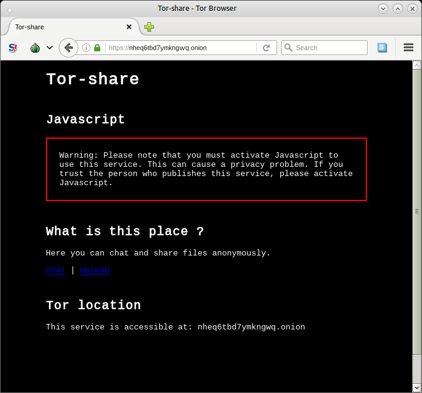

# Tor-sharing

## Purpose

With Tor-sharing you can chat, share files or publish a simple PHP website accessible with Tor, The Onion 
 Router. Tor-sharing is a ~50 MB Alpine Linux Docker container. 

Features:
* Chat 
* Share files
* Publish a simple PHP website

## Authentication

Visits are restricted with Lighttpd basic authentication. Default credentials are:

    anonymous-tux:password
    anonymous-tux2:password2

Before building you can add users or change passwords:
    
    $ vim etc/lighttpd/lighttpd-password

## Getting started

Launch Tor-sharing on Ubuntu 16.04:

    # First you need to install Docker
    $ curl -sSL https://get.docker.com/ | sh
    
    # After create a Docker image
    $ git clone https://github.com/remipassmoilesel/tor-sharing
    $ cd tor-sharing
    $ git submodule init
    $ git submodule update
    $ docker build . -t tor-sharing
    
    # Then launch a container and bind ports
    $ docker run -d -p 9050:9050 tor-sharing
    
    /!\ Warning /!\ Never, never, never bind port 80. 
    No one should be able to access container without using TOR. 
    
## Get URL of hidden service
    
    # First get container IP address 
    $ docker ps 
        
        CONTAINER ID        IMAGE               ...
        2e23d01384ac        ...
  
    $ docker inspect --format '{{ .NetworkSettings.IPAddress }}' 2e23d 
        
        172.17.0.2
    
    # Then visit http://172.17.0.2 adress with a normal browser or:
    $ curl -u anonymous-tux:password http://172.17.0.2/hostname 
    
        7b436d6e7ipz4kbo.onion
    
    
    

